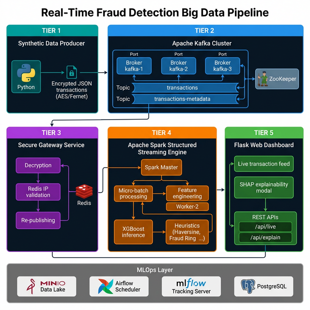

# GigShield AI: Zero-Touch Parametric Insurance for the Gig Economy

## Overview

In the fast-paced gig economy, weather and environmental disruptions mean zero income for millions of delivery partners. Traditional insurance fails because it is too slow, too complex, and unequipped for 4-hour rainstorm disruptions.

**GigShield AI** is a zero-touch parametric insurance platform built entirely autonomously. By monitoring real-time weather and traffic APIs, we detect disruptions as they happen. An AI Risk Engine uses historical volatility to keep premiums micro-sized, and instantly triggers a claim payout to the worker when an adverse event (like heavy rainfall) hits their delivery zone.

## Core Features

- **Zero-Touch Parametric Insurance**: No human adjusters. Smart logic triggers payouts instantly through a simulated UPI pipeline.
- **AI Risk Engine**: Dynamically sizes premiums using predictive models such as XGBoost based on historical and real-time zone volatility.
- **Zero-Trust Adversarial Defense System**: A sophisticated 4-layer validation gate to prevent automated payout fraud. It uses **Isolation Forests** and **Graph Analysis** to stop GPS spoofing and identify coordinated fraud rings using device integrity, IP proximity, and behavioral patterns.
- **Instant Onboarding**: Friction-free access for workers via a lightning-fast web dashboard.
- **Real-Time Data Pipelines**: Spark Streaming, Kafka message brokers, and Airflow orchestration for continuous fraud detection and model training.

## System Architecture & Technical Stack

- **Data Generation & Ingestion**: `src/producer` generates robust transactional and behavioral mock data.
- **Distributed Processing Pipeline**: Real-time fraud detection analytics implemented with **Apache Spark (Scala/PySpark)** (`src/spark`).
- **Orchestration**: **Apache Airflow** DAGs (`src/airflow`) schedule and manage the continuous model training cycles.
- **Web App & Gateway**: Frontend user dashboard and secure API gateways for interacting with the risk engine. (`src/web_app`, `src/gateway`)
- **Monitoring & Observability**: Integrated **Prometheus** and **Grafana** dashboards (`src/monitoring`) to track inference performance and API health.

## Phase 1 Execution Roadmap
- [x] **Sprint 1 & 2**: Core backend setup, AI logic, and autonomous trigger simulation.
- [ ] **Sprint 3 (Upcoming)**: Integrating real-time OpenWeather and TomTom telemetry APIs.
- [ ] **Sprint 4 (Future)**: National scale, predicting and protecting workers across all major Tier-1 cities.

## Getting Started

To spin up the local development environment:
1. Make sure you have Docker and Docker Compose installed.
2. Run `docker-compose up -d` to bring up the pipeline (Kafka, Spark, Airflow, Web App, Monitoring).
3. Check `documentation/` for deep dives into dataset structuring, big data stack logic, and the transaction lifecycle.
4. Access the main Web App and Grafana Dashboards via configured localhost ports.

---
*GigShield AI: We are ready to build the future of gig stability. Insuring the invisible workforce.*